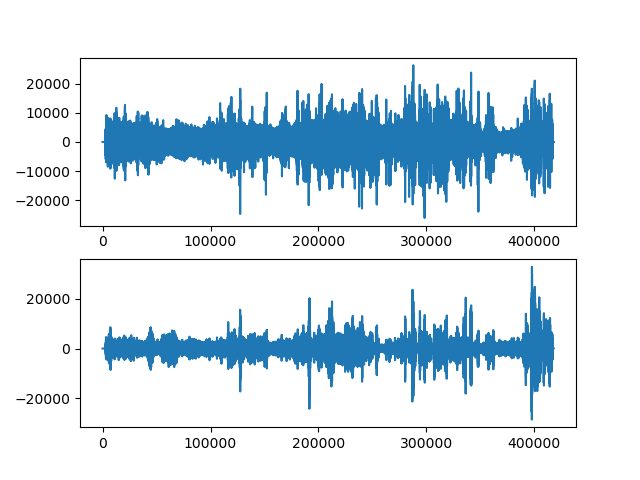
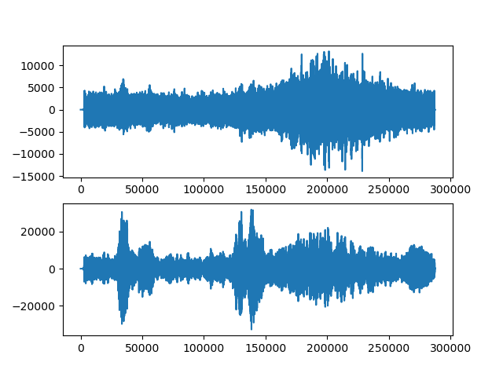

# Python-Remove-Background-Noise

### 필터의 효과

▲위-sample_1.wav, 아래-필터를 거친 sample_1.wav

▲위-sample_2.wav, 아래-필터를 거친 sample_2.wav

직접 필터를 거친 샘플 청취를 해보면 드론의 소리는 대부분 사라지고
사람의 목소리만 남아있다.

### 필터의 원리
사람의 음역대는 대략 300-3000Hz 이다. 
그러나 다른 소음의 음역대와 겹치는 부분을 최대한 줄이기 위해 
그 중 400-750Hz의 음역만 유지하고 나머지 부분은 소거하였다.

그래서 시끄러운 환경에서도 상대적으로 조용한 사람의 목소리를 들을 수 있다.

### 필터의 한계점
+ 사람의 음역대를 축소하였기 때문에 
설정한 음역대를 초월하는 목소리를 낸다면 필터 과정에서 소거 될 수 있다.
+ 다른 사람이나 기계가 해당 음역대에 의도적으로 잡음을 만드는 것은 막을 수 없다. 

### 사용법
python 3.7을 설치하고 requirements.txt 에 있는 라이브러를 설치한다. \
resource 에 필터를 거치고자하는 오디오 파일을 wav 로 입력후  main.py를 실행하면
output 에 같은 이름으로 필터를 거친 오디오 파일이 생성된다. 

### 참조
- https://en.wikipedia.org/wiki/Voice_frequency
- https://en.wikipedia.org/wiki/Low-pass_filter
- https://en.wikipedia.org/wiki/High-pass_filter
